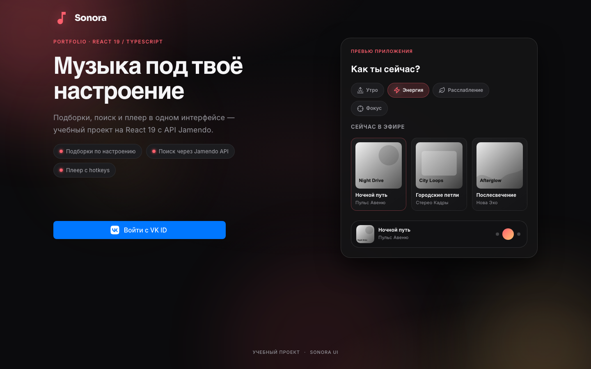
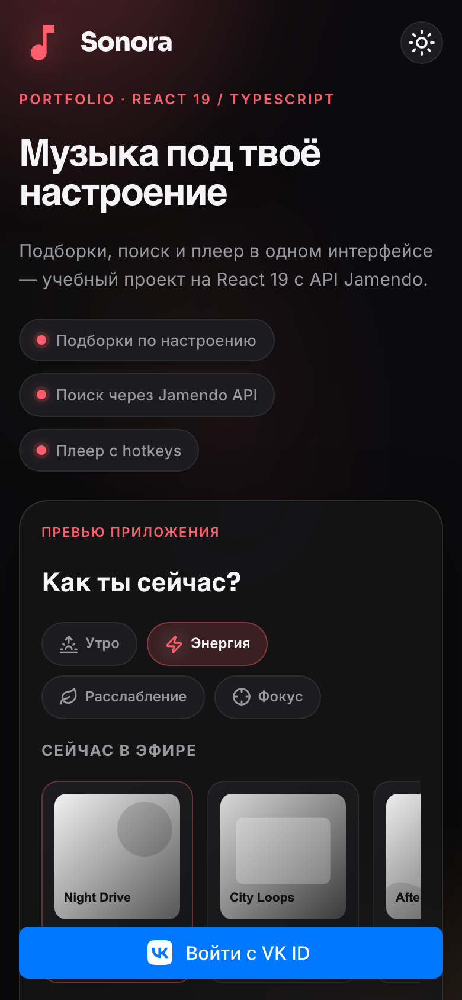

# Sonora

[](https://github.com/egorov-tech/sonora/actions/workflows/ci.yml)


Музыкальный плеер на React 19 + TypeScript: реальные треки из Jamendo API, подборки
по настроению с автовыбором по времени суток, очередь, плейлисты, dark/light тема.

**Демо:** <https://egorov-tech.github.io/sonora/>

| Десктоп | Мобильный |
|:-:|:-:|
|  |  |

## Что умеет

- **Воспроизведение** реальных треков: очередь, shuffle, repeat, громкость, горячие клавиши
- **Подборки по настроению** (утро / энергия / фокус / расслабление / ночь), стартовая — по времени суток
- **Поиск** по Jamendo с debounce и фильтром по жанрам
- **Медиатека**: создание и удаление плейлистов
- **Адаптив** от телефона до десктопа, сворачиваемый сайдбар, тема на CSS-переменных
- **Вход** через VK ID (OneTap); на localhost — демо-вход без VK

## Архитектура

```
src/
├── app/       роутинг, layout, провайдеры, гард RequireAuth
├── modules/   фичи: auth, shell (главная, поиск), library, player
├── store/     MobX: playerStore (аудио + очередь), authStore
├── shared/    API-клиент Jamendo, маппер DTO → модель, утилиты, UI-примитивы
├── types/     доменные типы Track, Playlist
└── styles/    токены и тематические слои
```

Данные идут в одну сторону: `shared/api` получает DTO Jamendo → `jamendoMapper`
превращает их в доменный `Track` → сторы хранят только доменные модели → компоненты
читают сторы через `observer`. Формат внешнего API не протекает дальше маппера.

## Решения и компромиссы

**Защита от гонки при переключении треков.** Быстрые клики «следующий» запускают
несколько загрузок аудио, и ответ старой может прийти последним. `playerStore`
увеличивает счётчик поколения на каждую загрузку и игнорирует события, если поколение
уже сменилось. Отмена через `AbortController` не помогла бы: `HTMLAudioElement` грузит
поток сам, а не через `fetch`.

**Не перезапускать уже играющую очередь.** Если пользователь снова жмёт «играть» на той же
подборке, стор сравнивает треки по `id` и продолжает текущую очередь, а не сбрасывает
позицию.

**MobX вместо Redux.** Плеер — это много мелкого изменяемого состояния (время, громкость,
очередь, флаги), и позиция воспроизведения обновляется несколько раз в секунду. MobX обновляет только
подписанные компоненты без селекторов и мемоизации вручную. Цена — глобальные
сторы-синглтоны: для учебного приложения это приемлемо, в большом проекте их стоило бы
отдавать через контекст ради тестируемости.

**HashRouter.** GitHub Pages не умеет отдавать `index.html` на произвольный путь, поэтому
маршруты живут после `#`. Ради красивых URL понадобился бы хостинг с rewrite-правилами.

## Качество

CI на каждый push и PR: ESLint, Stylelint (BEM), Prettier, `tsc --noEmit`, тесты
(Vitest), сборка. Тесты: поведенческие для форматирования и склонений, smoke-рендер
всего приложения в jsdom с подменённой сетью — тесты не зависят от доступности Jamendo.

## Запуск

```bash
cp .env.example .env   # VITE_VK_APP_ID — только для входа через VK
npm install
npm run dev            # http://localhost:33000
```

| Команда | Что делает |
|---|---|
| `npm test` | тесты (Vitest) |
| `npm run lint` / `lint:styles` | ESLint / Stylelint |
| `npm run typecheck` | проверка типов |
| `npm run build` | продакшн-сборка |

Деплой на GitHub Pages — `.github/workflows/static.yml`, базовый путь задаёт `VITE_BASE_PATH`.
Для входа через VK ID нужен HTTPS и приложение на [dev.vk.com](https://dev.vk.com/).

## Стек

React 19 · TypeScript · MobX 6 · React Router 6 · Vite 5 · Vitest · Jamendo REST API
